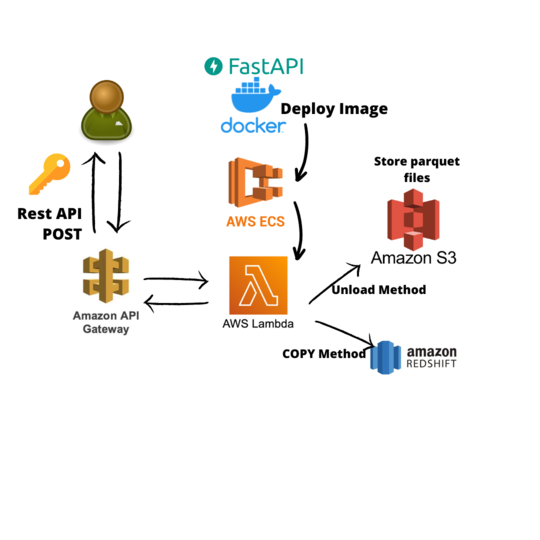

# Coding Challenge Globant 🚀
Data Engineer globant challenge, this project is a big data migration
to a new database system.

The project is divided in two parts:
1. Challenge #1: Migrate csv to new database system by Rest API
2. Challenge #2: Data Exploration

- [Coding Challenge Globant 🚀](#coding-challenge-globant-)
  - [1. Challenge #1](#1-challenge-1)
    - [1.1 Project Architecture](#11-project-architecture)
      - [1.1.1 FastApi + docker + lambda](#111-fastapi--docker--lambda)
      - [1.1.2 Docker + ECR + lambda](#112-docker--ecr--lambda)
      - [1.1.3 API Gateway + Lambda](#113-api-gateway--lambda)
      - [1.1.4 S3 + Redshift](#114-s3--redshift)
    - [1.2 Backup Architecture](#12-backup-architecture)
    - [1.3 How to run the project?](#13-how-to-run-the-project)
    - [1.3.1 Run locally](#131-run-locally)
      - [1.3.2 Env required:](#132-env-required)
      - [1.3.3 Deployment process:](#133-deployment-process)
    - [1.4 RESTAPI Paths](#14-restapi-paths)
      - [Important:](#important)
      - [Upload csv files into redshift](#upload-csv-files-into-redshift)
      - [Backups](#backups)
    - [1.5 Limitations](#15-limitations)

## 1. Challenge #1
### 1.1 Project Architecture

#### 1.1.1 FastApi + docker + lambda
The general idea is create a rest api to move csv files into a db.
On my case, I want to be simple but robust, so my idea is use Fastapi that is a incredible
simple and easy to use api to create the routes.

After, to upload files into redshift, that is the final db as datawarehouse, it follows the next:
1. Break files into 1k rows to process it better.
2. Validate data schemas for every table -> hired_employees, jobs, and departments.
3. Logs erros -> you can track it on lambda logs.
4. Return a cleaned data and store it in s3.
5. Finally, use COPY Method to copy s3 files into redshift.

#### 1.1.2 Docker + ECR + lambda
In general, I prefer not handle with infrastracture, so AWS provide a package of tools that we can
use a serverless, that is the case for Lambda functions.

Lambda functions is pretty good to run code only when is required, and this can use docker images that are
store in a ECR (elastic container).

So, on that part we use docker to container our app (fastapi) into a image that lambda can read it as a 
handler that receive request and return http responses.

This docker image we need to manually deploy to ECR (Note: this is pending to improve and do it every time that we deploy code into main branch), so in that way lambda can read this image as source of code to get request.

#### 1.1.3 API Gateway + Lambda
So, API Gateway acts as a "front door" for applications to access data, business logic, or functionality from your backend services.

There will be our front door to send POST to upload -> hired_employees, jobs, and departments csv into redshift, of course to use it we should have an api key to access.

It has configure all the paths to use and the lambda connection function to execute our api and do its magic.

#### 1.1.4 S3 + Redshift

At this point, you will ask why this db ? and so on... Well, first why the db?
- Redshift is a cloud-based, big data warehouse solution offered by Amazon, it can store petabytes of data
in easy-to-access “clusters” that can be queried in parallel, sounds good isn't it?
- You can run sql as postgresql.
- Redshift is a columnar database better suited for analytics
- And so on...

So, to keep and track everything simple I decided to store s3 files as a csv cleaned chucks (every chunk is 1k rows), and then just run a very good method, that is a sql method provided for redshift called COPY to ingest s3 files into tables.

### 1.2 Backup Architecture

Backup pipeline use practically the same logic as before but now to create a backup it use UNLOAD method that
creates PARQUET files and store them into s3. In the other hand, for recover info you need to send the table +
location of the s3 to recovery by POST Method, using COPY function.

### 1.3 How to run the project?
### 1.3.1 Run locally
1. At this point everything as base uses poetry as a management packaging system, so first install [poetry](https://link-url-here.org).
2. Run `poetry install` to install all the dependencies.
3. And to run the app (fastapi) first go to `poetry shell` and run `uvicorn main:app --reload`.
4. Now you can go play with the rest api.
5. Of course, and this is super important the code use env for: general access to s3, and creds for redshift. You should create your s3 buckets, IAM user to access to s3, and redshift db with required tables and use creds to play.

#### 1.3.2 Env required:
- AWS_BUCKET = "raw-challenge-globant-uploads" # Main bucket to handle all the process
- AWS_KEY_ID = os.getenv("KEY_ID") # AWS Key user to play with s3
- AWS_SECRET_KEY = os.getenv("SECRET_KEY") # AWS secret key user to play with s3
- DB_NAME = os.getenv("DB_NAME") # Redshift db name
- HOST = os.getenv("DB_HOST") # Host db
- USER = os.getenv("DB_USER") # User db
- PASSWORD = os.getenv("DB_PASSWORD") # Password db

Note: all of them are created in lambda, there we can create env to use.

#### 1.3.3 Deployment process:
At this point, there is a repo called globant_challenge in ecr, and a Dockerfile really to deploy, so:
1. First we need to run: `aws ecr get-login-password --region us-east-2 | docker login --username AWS --password-stdin 132364597855.dkr.ecr.us-east-2.amazonaws.com` to recovery auth token.
2. Build docker image: `docker build -t globant_challenge .`
3. Tag our image as latest: `docker tag globant_challenge:latest 132364597855.dkr.ecr.us-east-2.amazonaws.com/globant_challenge:latest`
4. Push image to repo: `docker push 132364597855.dkr.ecr.us-east-2.amazonaws.com/globant_challenge:latest`.

Note: There are ways to automate this process using github actions and so on, but for time due was impossible for me to do it.

### 1.4 RESTAPI Paths
#### Important: 
- All the paths are POST Methods.
- Prod URL: https://367h0vqbdg.execute-api.us-east-2.amazonaws.com/prod/.
- It requires to send a x-api-key in the header as a auth method.

#### Upload csv files into redshift
For
- /api/v1/upload_departments
- /api/v1/upload_jobs
- /api/v1/hired_employees

They require to send a file (binary) in form-data, the key: file, and value the csv file.
It will return "status_code": 200 for success message or 400 for errors.

#### Backups
Paths:
- /api/v1/create_backup
  
For creating a backup it requires the next param: `table` that it should only be: hired_employees, departments, or jobs.
It will take all the data and store it as parquet file into s3.
Note: I decided to use parquet instead of avro because
redshift is not able to unload in avro format, and parquet is pretty good to handle big data, and is columnar base that is a plus.

- /api/v1/upload_parquet_backup
For upload a backup it requires the next params: `s3_location` and `table` to ingest the backup.
It will take the location of the file and apply a COPY method to upload the file into redshift.

### 1.5 Limitations
1. Redshift is not good to handle duplicate data, so I see some problems if you upload the same data multiples times.
2. CD/CI is not provided on this, it should be the next steps to do to have like a real project.
3. Not sure how big files are, it uses pandas library to validate the schema, and load the file, but this will be a problem if you handle big big files, so next step should be use spark or a very good big data handler for big files, or just break files before call the api.

